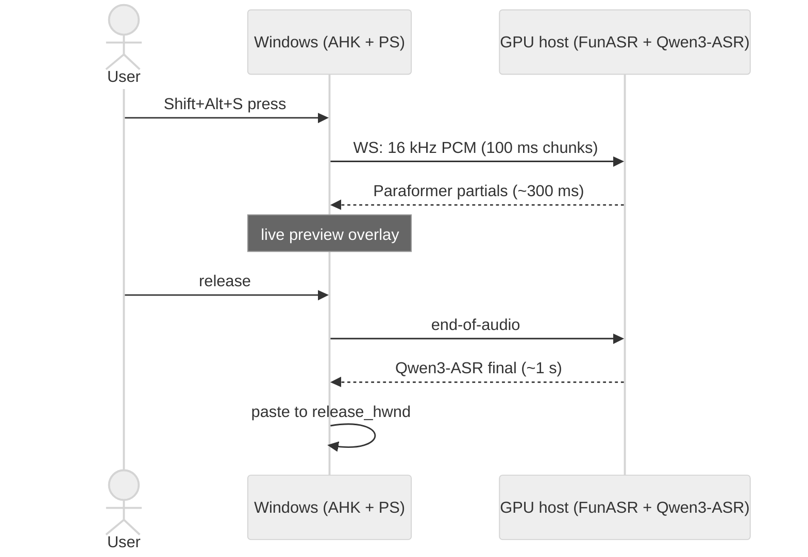

# voice-stt

**([简体中文](./README.zh.md) | English)**

[](LICENSE)
[](CHANGELOG.md)
[](#install)

> **Sub-second self-hosted voice-to-paste for Windows + WSL.** Push-to-talk
> dictation with dual-pass ASR (FunASR Paraformer streaming + Qwen3-ASR-1.7B
> final), live partial-transcript preview, zero cloud dependency by default,
> runs on a 12 GB consumer GPU.

```
Shift+Alt+S  →  hold to dictate, release to paste  (streaming + live preview)
Shift+Alt+V  →  batch PTT (WAV → Whisper-compatible HTTP gateway)
Shift+Alt+P  →  read selected text aloud (SAPI TTS, zero-latency)
```

---

## ✨ Features

- **Dual-pass ASR** — Paraformer streaming for `~300ms` partial captions while
  you're still speaking, Qwen3-ASR-1.7B final pass for `~1s` accurate paste-able text
- **Warm mic capture** with `~300ms` pre-roll ring buffer (no clipped first syllable)
- **Left-channel-only recording** rescues headsets with one broken mic element
- **Hotword auto-learning** — terms appearing ≥ 3× in 30 days get promoted into
  `hotwords.yaml` automatically; works with deterministic post-correct mappings
- **Local recovery log** — every dictation event in monthly JSONL with a
  `transcript-grep.sh` helper to recover paste-into-wrong-window mishaps
- **Fully self-hosted** — default path has zero cloud dependency; audio never
  leaves your network. Tailscale / LAN access only

---

## 🎬 Demo

> Demo GIF and screencast — TODO ([tracked in CHANGELOG](CHANGELOG.md))

---

## 🏗 Architecture



Two-process design: Windows client (capture + UI) talks to a Linux GPU host
(ASR backend) over WebSocket. Full diagram + roles + security boundary in
**[docs/ARCHITECTURE.md](docs/ARCHITECTURE.md)**.

---

## 🚀 Install

**Requires:** Windows 10+, PowerShell 5.1+, `ffmpeg` on PATH
(`winget install --id Gyan.FFmpeg -e`). AutoHotkey v2 is installed
automatically by `install.bat`; for portable mode you install it once
yourself.

Download the [latest release ZIP](../../releases/latest) (`voice-stt.zip`),
extract anywhere, then double-click one of:

| Mode | File | What happens |
|---|---|---|
| **Installed** (autostart on login) | `install.bat` | Downloads AHK v2 if absent → copies scripts to `%LOCALAPPDATA%\voice-stt\` → seeds `.env` → registers Startup shortcut |
| **Portable** (no install) | `start.bat` | Reads `.env` from the extracted folder → launches `voice-hotkey.ahk`. Requires AHK v2 pre-installed |
| **Developer** (from git) | `git clone … && .\install.ps1` | Same as Installed, but from a working copy |

> **SmartScreen** will warn about unsigned scripts. Click **More info → Run
> anyway**. Review `install.ps1` yourself if you want — it's plain
> PowerShell.

**Portable mode prerequisite:** install AHK v2 from
[autohotkey.com](https://www.autohotkey.com) so `AutoHotkey64.exe` lands at
`%LOCALAPPDATA%\Programs\AutoHotkey\v2\`. For auto-install, use
`install.bat` instead.

---

## ⚡ Quick start

The full first-run walkthrough is at **[docs/QUICKSTART.md](docs/QUICKSTART.md)**.
Minimum required `.env` after install:

```ini
ASR_WS_URL=ws://192.168.1.50:8082/    # your FunASR server
RECORD_DEVICE_NAME=Microphone Array   # discover: record.ps1 -Diagnose
```

---

## 📝 Vocabulary management

voice-stt has three layers of vocabulary control, all driven by
`server/hotwords.yaml` on the GPU host:

| Layer | Where | What it does |
|---|---|---|
| **Hotwords** (term list) | `hotwords.yaml` category sections (`ai_agent:`, `cs_research:`, etc.) | Biases Qwen3-ASR's system context + Paraformer hotword boost. Bare term lists, deduped at server startup |
| **Mappings** (post-correct) | `hotwords.yaml` `mappings:` section | Deterministic LHS → RHS replacement on the final text (e.g., `"queen 3": "Qwen3"`) — runs after ASR, fixes common homophones the model misses |
| **Snippets** | `hotwords.yaml` `snippets:` section | Spoken-shorthand expansion (e.g., `my-email: "<your-email>"`) — `my email` in transcript becomes the full email |

**Auto-promotion:** the gateway's `/v1/text/learn` endpoint mines (wrong,
right) pairs from session history. Pairs occurring ≥ 3× in the last 30 days
are auto-appended to `hotwords.yaml` under an `auto_promoted:` section (daily
cap of 5 to prevent runaway). Audit log at `hotwords-auto-promoted.jsonl`.

WSL helpers under `wsl/`:
- `add-hotword.sh` — interactive promotion with atomic SCP + server reload
- `learn-review.sh` — review accumulated (wrong, right) pairs from the learn log
- `vocab-sync.sh` — manual atomic deploy of `hotwords.yaml`

Reload is hot — server watches mtime and supports `SIGUSR1` /
`POST /v1/vocab/reload` for explicit triggers.

---

## 🗂 History & recovery

Every dictation event (`ok` / `empty` / `no_out` / etc.) appends a JSONL
record to:

```
%LOCALAPPDATA%\voice-stt\transcripts\YYYY-MM.jsonl
```

Local-only, never uploaded. Month-rotating. Use `wsl/transcript-grep.sh` to
search:

```bash
./wsl/transcript-grep.sh --since 1h --grep "embedding"
./wsl/transcript-grep.sh --last 20 --status ok
```

Supports `--last N`, `--since 1h|30m|2d`, `--grep <pattern>`,
`--status <ok|empty|no_out|...>`, and `--raw` for full JSON.

If paste lands in the wrong window (e.g., focus drifted during a long
recording), the text is never lost — pull it from the JSONL with `--grep`
and re-paste manually.

---

## ⚙️ Configuration

All options live in `.env` (created from `.env.example` by the installer).
See **[docs/CONFIG.md](docs/CONFIG.md)** for every variable, default, and
"when to change" guidance.

---

## 🖥 Self-hosting the ASR server

See **[server/README.md](server/README.md)** for GPU server setup: vLLM
loading Qwen3-ASR (0.6B default; 1.7B preset on ≥ 12 GB FP8-capable cards
like RTX 4070 Ti) + FunASR Paraformer + optional Whisper batch path.
Includes VRAM tuning matrix per consumer GPU and CUDA path troubleshooting.

---

## 🤖 For AI Agents

If you're an LLM-driven coding agent picking up this repo, the fastest path
to productive edits:

- **Read first:** `README.md` (this), `docs/ARCHITECTURE.md` (two-process
  design, sequence diagrams), `CHANGELOG.md` (v0.1.0 scope + v0.2 plans).
- **Repo layout:**
  - `server/` — Python ASR backend (FastAPI WS + ASR backends + post-process).
    Entry points: `funasr-stream-server.py` (streaming), `mini-gateway.py` (batch HTTP).
  - `windows/` — AutoHotkey v2 client (`voice-hotkey.ahk`) + PowerShell helpers.
  - `wsl/` — Bash helpers for hotword management, transcript search, deploy.
  - `deploy/`, `infra/` — server bootstrap scripts.
  - `docs/` — user + dev documentation.
- **Architecture invariants:**
  - Streaming path (Shift+Alt+S) is the primary user flow — don't break partial
    preview latency or final paste mechanics.
  - Recovery JSONL must capture every dictation event for the
    `transcript-grep.sh` audit trail to remain useful.
  - Hotwords are case-sensitive for English brand terms; `hotwords.yaml`
    drives both Paraformer boost and Qwen3-ASR system context.
- **Common edits:**
  - Add a hotword: edit `server/hotwords.yaml` `user_added:` + run
    `wsl/vocab-sync.sh` (or let the server's mtime watcher reload).
  - Adjust ASR system prompt: `server/funasr-stream-server.py:106` `load_qwen3_context()`.
  - Add a paste mode hotkey: `windows/voice-hotkey.ahk` register at the top.
- **Deployment:** Windows client = `.\install.ps1`. GPU server =
  `bash start-stream-vllm.sh` from `voice-stack/` on the GPU host.

---

## 🤔 Why we built it

Most desktop dictation tools are either macOS-only (Wispr Flow, Aqua Voice),
cloud-only with monthly subscriptions, or IME-mode (讯飞) rather than
paste-anywhere. voice-stt fills a specific gap: **Windows + WSL push-to-talk
with self-hosted GPU ASR**, dual-pass for both `~300ms` partial preview and
`~1s` final accuracy, full ownership of hotwords / history / recovery logs,
and zero cloud dependency by default.

It's optimized for one user (the maintainer) who dictates daily into Claude
Code / Codex / Cursor terminal sessions, with technical terms (Tailscale,
Qwen3-ASR, embeddings, …) that generic ASR mispronounces. If that's your
scenario too, it should fit cleanly.

---

## 🗺 Roadmap (v0.2)

Active design space, not yet implemented:

- **Cloud ASR backend** — make `ASR_BACKEND` switchable between `local`
  (current vLLM stack) and `cloud`. Candidate providers, all of which support
  streaming WS so the partial-preview UX is preserved:
  - Aliyun DashScope `qwen3-asr-flash` (same Qwen3-ASR family, prompt-compatible)
  - Deepgram Nova-3
  - OpenAI gpt-4o-transcribe
- **Zero-CUDA local fallback** — the transformers backend already runs without
  vLLM (~20-50× slower, no FlashInfer compile). Will be promoted to a
  first-class "easy install" mode for users who don't need < 1 s final
  latency.
- **Strict-correction LLM post-process** — separate from the legacy `polish`
  endpoint (which rewrote semantics). Strict prompt + few-shot examples to
  fix ASR homophone errors without changing meaning. Runs after final,
  +0.3-0.8 s latency.
- **Voice commands** (e.g., `undo` / `new paragraph`) — exploring this layer
  but unclear if it's a better fit than ASR self-correction handled in the
  model.
- **Demo GIF / screencast** — long-pending.

See [docs/ARCHITECTURE.md § What's NOT in v0.1](docs/ARCHITECTURE.md#whats-not-in-v01-and-v02-plans)
for the full discussion.

---

## 🙏 Acknowledgments

Built on top of:
- [FunASR](https://github.com/modelscope/FunASR) — Paraformer streaming ASR
- [Qwen3-ASR](https://github.com/QwenLM/Qwen3-ASR) — final-pass ASR (Qwen team)
- [vLLM](https://github.com/vllm-project/vllm) — GPU inference runtime
- [OpenAI Whisper](https://github.com/openai/whisper) — batch backend
- [AutoHotkey v2](https://www.autohotkey.com) — Windows hotkey + UI layer

See [THIRD_PARTY_NOTICES.md](THIRD_PARTY_NOTICES.md) for licenses.

---

## 📜 License

[MIT](LICENSE). Contributions welcome — see
[CONTRIBUTING.md](CONTRIBUTING.md) and [SECURITY.md](SECURITY.md).

---

## ⭐ Star History

<a href="https://star-history.com/#fzhiy/voice-stt&Date">
  <picture>
    <source media="(prefers-color-scheme: dark)" srcset="https://api.star-history.com/svg?repos=fzhiy/voice-stt&type=Date&theme=dark" />
    <source media="(prefers-color-scheme: light)" srcset="https://api.star-history.com/svg?repos=fzhiy/voice-stt&type=Date" />
    
  </picture>
</a>
