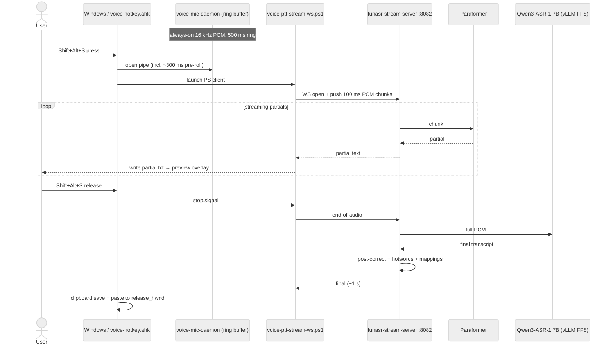
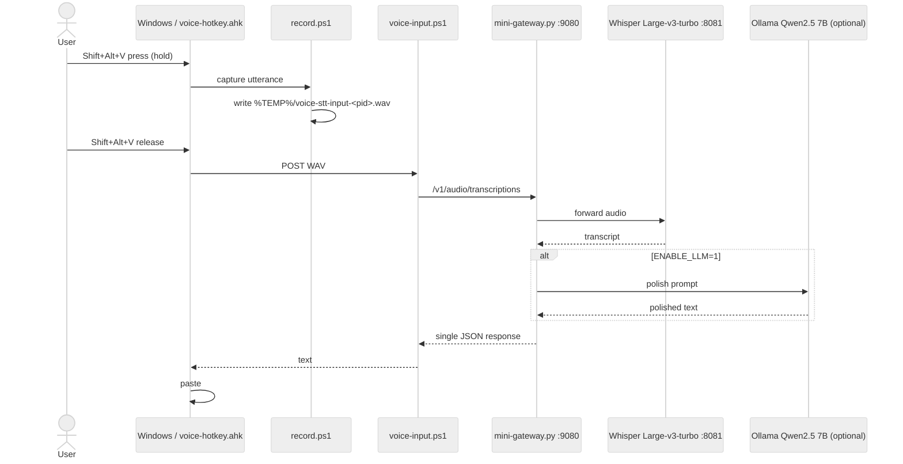

# Architecture

voice-stt is a **two-process system**: a Windows client that captures audio
and renders the caption, and a Linux GPU host that runs the ASR models. They
talk over WebSocket (streaming path) or HTTP (batch path).

---

## Roles

| Node | Role | What runs |
|---|---|---|
| **Windows host** | Capture + UI | AutoHotkey hotkey daemon, ffmpeg mic capture, PowerShell WebSocket client, caption renderer |
| **Linux GPU host** | ASR backend | `funasr-stream-server.py` (streaming) and/or Docker Compose stack (batch); FunASR Paraformer + Qwen3-ASR (0.6B default, 1.7B optional) |

A single GPU host can serve many Windows clients on the same Tailscale or LAN
network.

---

## Streaming path (Shift+Alt+S, primary)

The low-latency dictation flow. WebSocket carries PCM upstream and partial /
final transcripts downstream.

**Latency budget** (typical):
- Partial captions: ~300 ms after speech onset.
- Final transcript: ~1 s after Shift+Alt+S release.

---

## Batch path (Shift+Alt+V, optional)

Used when the streaming path isn't available, or when you want to swap in a
cloud Whisper-compatible API. Records the whole utterance to a WAV file,
uploads it, gets a single response.

**Latency budget**: 3-10 s for a ~10 s utterance, depending on Whisper config
and whether LLM polish is enabled.

---

## Why this design

### Capture on the Windows client, not on the GPU host

Audio capture is path-shortest where the user is. Sending PCM over the
network adds 5-50 ms; routing the user's audio device through the GPU host
adds rewriteable layers and breaks when the user is on a different network.

### WebSocket for streaming, HTTP for batch

WebSocket keeps a hot connection so partial transcripts can stream back
without re-handshaking. HTTP is what every Whisper-compatible API speaks, so
the batch path doubles as the future cloud-ASR bridge (planned for v0.2).

### Qwen3-ASR-1.7B for final, Paraformer for partials

Paraformer is fast (~50 ms inference) but lower accuracy; great for the
live caption while you're still speaking. Qwen3-ASR-1.7B is heavier (~500 ms
inference) but much more accurate; runs once on the full audio after release
to produce the final paste-able text.

### Tailscale or LAN, not a public endpoint

Easier to secure (mesh + ACL), no certificate management, no public IP
required, and zero per-month cost for personal use. The server binds to
`127.0.0.1:8082` by default (loopback only); set `STREAM_HOST=0.0.0.0` to
expose over LAN / Tailscale and gate with a firewall + Tailscale ACL.

---

## Security boundary

- **Transport**: Tailscale provides WireGuard end-to-end encryption by
  default; LAN deployments inherit your local network's trust model.
- **Server binding**: `funasr-stream-server.py` listens on `127.0.0.1`
  (loopback) by default — no network exposure out of the box. Override
  with `STREAM_HOST=0.0.0.0` to bind to all interfaces, then gate with a
  firewall + Tailscale ACL (or LAN-only routing).
- **Local artifacts**: WAV captures land at `%TEMP%\voice-stt-*.wav` and are
  deleted by the client after upload. Partial caption state at
  `%LOCALAPPDATA%\voice-stt\partial.txt` is plain text and overwritten each
  utterance.
- **Logs**: trace logs at `%LOCALAPPDATA%\voice-stt\*.log` may contain
  transcript fragments. They are local-only; rotate or delete if you share
  the machine.

---

## What's NOT in v0.1 (and v0.2 plans)

For honesty's sake, voice-stt's architecture history includes paths that
are NOT shipping in v0.1:

- **iPhone / mobile capture** — Tailscale-based iPhone dictation flow exists
  in the project's history but isn't tuned or tested enough for OSS release.
  Deferred.
- **PWA + VPS reverse proxy** — Caddy + autossh + Tailscale TLS termination
  on a separate VPS for a PWA front-end. Same status: deferred.

Active v0.2 design space (not yet implemented):

- **Cloud ASR backend** — make `ASR_BACKEND` switchable between `local`
  (current vLLM stack) and `cloud` so users without a GPU can run the same
  client. Candidate providers, all of which support streaming WS so the
  partial-preview UX is preserved: Aliyun DashScope `qwen3-asr-flash`
  (Qwen3-ASR cloud, identical prompt format to local 1.7B), Deepgram
  Nova-3, OpenAI gpt-4o-transcribe.
- **Zero-CUDA local fallback** — the current vLLM path needs CUDA 13 +
  flashinfer compilation, too heavy for many developers. The transformers
  backend is already a fallback (~20-50× slower); can be promoted to a
  first-class "easy install" mode for users who don't need < 1 s final
  latency.
- **Strict-correction LLM post-process** — separate from the previously
  disabled `polish` endpoint; intended to fix ASR homophone errors
  without rewriting semantics. Runs after final, +0.3-0.8 s.

The codebase still contains placeholders or partial implementations for
some of these. They're inert at runtime under v0.1 defaults.
