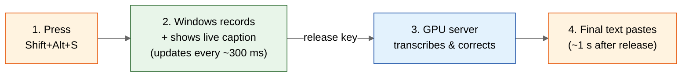
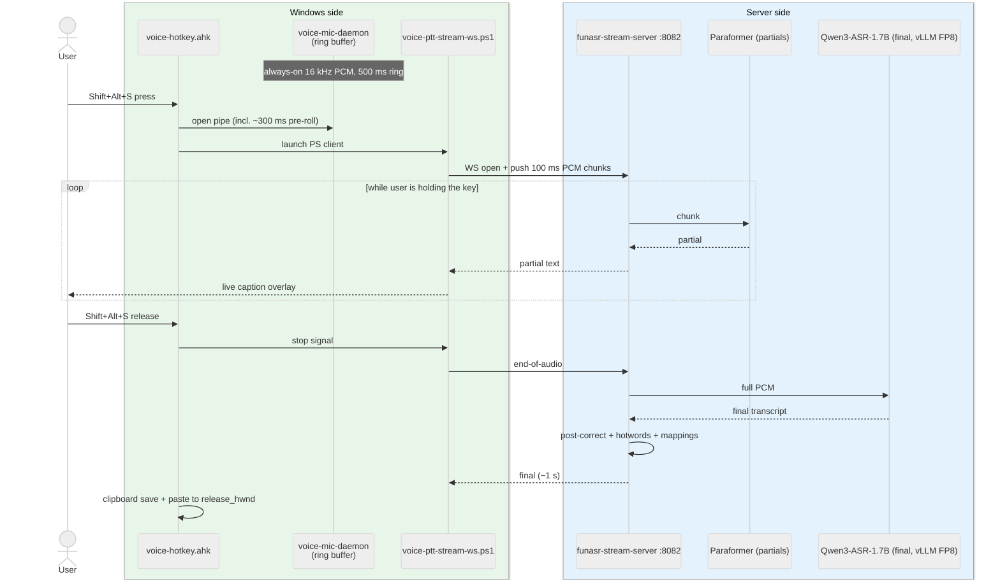
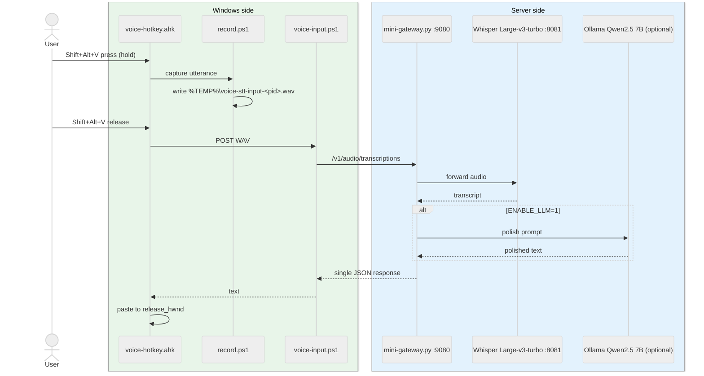

# Architecture

voice-stt is a **two-process system**: a Windows client captures audio and
renders the caption, and a Linux GPU host runs the ASR models.

This doc is layered top-down — read as far as you need.

- **Layer 1** (any user): the mental model — what happens when you press the key.
- **Layer 2** (power user / deployer): the two recording modes and when each is used.
- **Layer 3** (developer / contributor): wire-level sequence diagrams and design rationale.

---

## Layer 1 — How it works (mental model)

One push-to-talk gesture flows through four stages:

**What you see and feel**

- Hold `Shift+Alt+S` and speak. A live caption overlay appears under your
  cursor — that's the partial transcript, refreshing every ~300 ms while
  you're still talking.
- Release the key. About 1 second later, the corrected final text is pasted
  into whatever app had focus when you pressed.

**Who does what**

| Side | Responsibility (not "what runs") |
|---|---|
| **Your Windows PC** | Listens for the hotkey, captures the microphone, shows the live caption overlay, pastes the final text where your cursor was. |
| **A Linux GPU host** (yours or one you trust) | Receives the audio, runs the speech-recognition models, returns transcripts. |

A single GPU host can serve many Windows clients on the same Tailscale or LAN.

That's the entire user-facing story. Everything below is implementation
detail — skip it unless you're deploying or hacking on the code.

---

## Layer 2 — Two recording modes

voice-stt has two ways to get your speech to the server. You'll mostly use
streaming mode; batch mode exists as an escape hatch and as the bridge to
cloud Whisper-compatible APIs.

| | **Streaming mode** (default) | **Batch mode** (optional) |
|---|---|---|
| Hotkey | `Shift+Alt+S` | `Shift+Alt+V` |
| Live caption while speaking? | **Yes** (~300 ms partials) | No |
| Final-transcript latency | ~1 s after release | ~3–10 s for a ~10 s utterance |
| Transport | WebSocket (PCM in, text out) | HTTP (upload WAV, get JSON back) |
| Why use it | Everyday dictation. Low latency, live feedback. | When you want to swap the local stack for any Whisper-compatible HTTP API. |

Each hotkey is wired to one mode — there is no setting to flip between them.
If you don't need batch mode, you can ignore everything below and just use
`Shift+Alt+S`.

A third hotkey, `Shift+Alt+E`, cycles which **streaming backend** answers
`Shift+Alt+S` (local Qwen3 vs. cloud providers like 火山豆包 / Tencent /
讯飞 / OpenAI-compatible). It does not change the mode — only which server
the streaming WebSocket connects to. See
[docs/PROVIDERS.md](PROVIDERS.md).

---

## Layer 3 — Engineering detail

For developers and contributors. Diagrams use Mermaid `sequenceDiagram` with
participants grouped by **side** (Windows / Server) via `box` so the
horizontal lifelines aren't visually crowded.

### Streaming path (Shift+Alt+S, primary)

**Latency budget** (typical, GPU host on LAN):
- Live partial captions: ~300 ms after speech onset.
- Final transcript: ~1 s after key release.

### Batch path (Shift+Alt+V, optional)

**Latency budget**: 3–10 s for a ~10 s utterance, depending on Whisper config
and whether LLM polish is enabled.

### Why this design

**Capture on the Windows client, not on the GPU host.** Audio capture is
shortest-path where the user is. Routing the user's audio device through the
GPU host adds rewriteable layers and breaks when the user roams to a
different network.

**WebSocket for streaming, HTTP for batch.** WebSocket keeps a hot
connection so partial transcripts can stream back without re-handshaking.
HTTP is what every Whisper-compatible API speaks, so the batch path doubles
as the bridge to hosted Whisper providers.

**Qwen3-ASR-1.7B for final, Paraformer for partials.** Paraformer is fast
(~50 ms inference) but lower accuracy — great for the live caption while you
are still speaking. Qwen3-ASR-1.7B is heavier (~500 ms inference) but
substantially more accurate — runs once on the full audio after release.

**Tailscale or LAN, not a public endpoint.** Easier to secure (mesh + ACL),
no certificate management, no public IP, zero per-month cost for personal
use. The server binds to `127.0.0.1:8082` by default (loopback only); set
`STREAM_HOST=0.0.0.0` to expose over LAN / Tailscale and gate with a
firewall + Tailscale ACL.

---

## Security boundary

- **Transport**: Tailscale provides WireGuard end-to-end encryption by
  default; LAN deployments inherit your local network's trust model.
- **Server binding**: `funasr-stream-server.py` listens on `127.0.0.1`
  (loopback) by default — no network exposure out of the box. Override with
  `STREAM_HOST=0.0.0.0` to bind to all interfaces, then gate with a firewall
  + Tailscale ACL (or LAN-only routing).
- **Local artifacts**: WAV captures land at `%TEMP%\voice-stt-*.wav` and are
  deleted by the client after upload. Partial caption state at
  `%LOCALAPPDATA%\voice-stt\partial.txt` is plain text and overwritten each
  utterance.
- **Logs**: trace logs at `%LOCALAPPDATA%\voice-stt\*.log` may contain
  transcript fragments. They are local-only; rotate or delete if you share
  the machine.

---

## What's NOT in v0.1 (and v0.2 plans)

For honesty's sake, voice-stt's architecture history includes paths that
are NOT shipping in v0.1:

- **iPhone / mobile capture** — Tailscale-based iPhone dictation flow exists
  in the project's history but isn't tuned or tested enough for OSS release.
  Deferred.
- **PWA + VPS reverse proxy** — Caddy + autossh + Tailscale TLS termination
  on a separate VPS for a PWA front-end. Same status: deferred.

Active v0.2 design space (not yet implemented):

- **First-class hosted Whisper providers** — wire `OPENAI_API_KEY` Bearer
  auth into the batch HTTP path so users without a GPU can target
  openai.com / Groq / DeepInfra. (A WebSocket OpenAI-compatible streaming
  provider already shipped in v0.1.1 via `Shift+Alt+E` for self-hosted
  Whisper endpoints; this v0.2 item is specifically about hosted SaaS
  Bearer-auth on the batch path.)
- **Streaming-WS cloud candidates** — Aliyun DashScope `qwen3-asr-flash`
  (same prompt format as local Qwen3-ASR-1.7B), Deepgram Nova-3, OpenAI
  `gpt-4o-transcribe`. All support streaming WS so the partial-preview UX
  carries over.
- **Zero-CUDA local fallback** — the current vLLM path needs CUDA 13 +
  flashinfer compilation, too heavy for many developers. The transformers
  backend already works as a fallback (~20–50× slower); can be promoted to
  a first-class "easy install" mode for users who don't need <1 s final
  latency.

The codebase still contains placeholders or partial implementations for
some of these. They're inert at runtime under v0.1 defaults.
